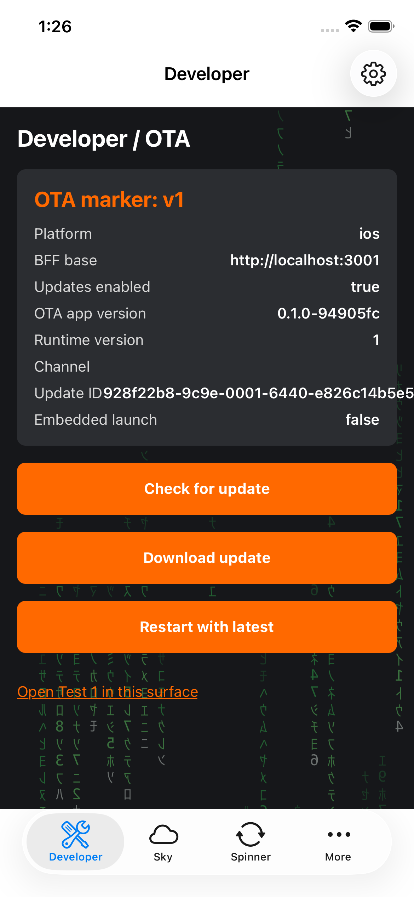
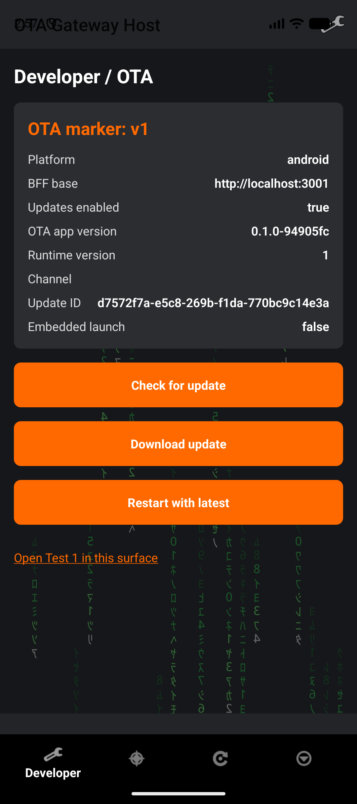

# react-native-ota-gateway

A demo / template monorepo that proves an end-to-end **self-hosted Expo OTA
update** stack (no EAS) plus a **Callstack brownfield** integration, with **zero
proprietary dependencies**. It is fully self-contained and generic, so it can be
read, run, and copied freely.

## Why this exists

Two problems most React Native teams eventually hit, solved in one small,
copyable tree:

- **OTA updates without a hosted service.** Expo's over-the-air updates are
  normally delivered by EAS Update (a paid, hosted service). But the Expo
  Updates protocol is *just HTTP* — a manifest plus content-addressed assets.
  Teams that need updates on their own infrastructure (compliance, air-gapped
  networks, an existing CDN, or simply no vendor lock-in) can serve it
  themselves. This repo does exactly that, with **no EAS and zero proprietary
  dependencies**.
- **Adopting RN in an app that already exists (brownfield).** Most real apps
  aren't greenfield — they're established native apps that want React Native
  *screen by screen*, with the native side still owning navigation. This repo
  ships the same JS as an iOS **XCFramework** and an Android **AAR** that a
  minimal native host embeds, while the *same* source tree also runs as
  standalone web and standalone native.

The interesting part is the seam where these meet: a self-hosted OTA bundle
delivered into a brownfield host, in both a hot-reload dev mode and a
release/OTA mode, on both platforms.

## What this is

One Expo SDK 55 / React Native 0.83 code tree (`apps/mobile`) that serves three
targets from the same source:

- **Standalone web** -- an Express server (the same server that hosts the OTA
  manifest) serving the Expo web build and its `+api.ts` routes.
- **Standalone iOS / Android** -- the app run directly via `expo run:ios` /
  `expo run:android`.
- **Brownfield artifacts** -- an iOS XCFramework and an Android AAR that a native
  host app embeds to render RN screens inside an existing native app.

Two minimal native host apps (`hosts/ios`, `hosts/android`) embed the brownfield
artifacts and own a four-item native tab bar (Developer, Sky, Spinner, More).
Each host keeps at most one RN surface mounted at a time and passes the selected
route as `initialUrl`, demonstrating that the host owns navigation state. The
More tab is fully native: a Test menu whose rows push RN and native screens on
one back stack (the mix-and-match demo). Components can opt into HOST-side
state persistence -- the fidget spinner keeps coasting across tab switches and
process death -- and RN screens can navigate into native screens over the
message bridge. Host-only OTA
environment and Metro controls live behind the Developer tab's native Settings
action.

The demo backend is the app's own server run as two instances: a **dev**
instance on `http://localhost:3000` and a **prod** instance on
`http://localhost:3001`. The same exported bundle is served by both; the
environment (chosen per instance) flips the gateway host stamped into the
manifest and the served update id, which demonstrates the dual-environment
gateway seam. For Mode B (release artifact) testing the two instances run as
**standalone Docker containers** (`docker compose up --build -d`) that bake the
export -- never as host-run dev servers; the host-run `pnpm server:*` scripts
exist only for standalone-web iteration. See
[docs/development-workflow.md](./docs/development-workflow.md).

## Screenshots

The brownfield host's Developer tab, running the self-hosted OTA bundle (Mode B)
on the iOS simulator and the Android emulator. Note the OTA marker, the
per-environment update id, `Embedded launch: false` (served from the gateway,
not the embedded fallback), and the native tab bar the host owns.

<p>
  
  &nbsp;&nbsp;
  
</p>

## Orientation

Everything canonical lives in [`docs/`](./docs). Read the relevant document
before working on a subsystem, and keep it current with any change (see
[AGENTS.md](./AGENTS.md)).

| Doc | Covers |
| --- | --- |
| [docs/architecture.md](./docs/architecture.md) | Monorepo layout, the dual-target model, who talks to whom, the Mode A/B matrix per platform. |
| [docs/ota-updates.md](./docs/ota-updates.md) | Self-hosted Expo Updates Protocol v1: manifest route, per-env update-id derivation, placeholder stamping, content-addressed assets, export-time manifest code signing, `OtaGate`, bridge reload. |
| [docs/brownfield.md](./docs/brownfield.md) | Packaging pipeline, the two config plugins, the full iOS + Android host-integration recipe, gotchas. |
| [docs/configuration.md](./docs/configuration.md) | The environment model: `OTA_ENVIRONMENT`, the runtime host-environment seam, the gateway map, where each value lives. |
| [docs/development-workflow.md](./docs/development-workflow.md) | Prerequisites, Mode A/B steps per platform, the runbook, verification. |

## Naming (used consistently everywhere)

| Concept | Name |
| --- | --- |
| RN module registered for brownfield | `OtaGatewayApp` |
| iOS framework / scheme | `OtaGatewayLib` |
| Android library module | `otagatewaylib` |
| Android/iOS package / group | `dev.otagateway` |
| Android AAR coordinate | `dev.otagateway:otagatewaylib:0.1.0-SNAPSHOT` |
| Manifest base-URL placeholder | `__OTA_GATEWAY_BASE_URL__` |
| Build-time env selector | `OTA_ENVIRONMENT` |
| Dev gateway / prod gateway | `http://localhost:3000` / `http://localhost:3001` |

## Glossary

Terms used throughout this repo and its docs:

| Term | Meaning |
| --- | --- |
| **Brownfield** | Embedding React Native into an *existing* native app (vs. a greenfield RN app). Here: an iOS XCFramework / Android AAR that `hosts/*` embed. |
| **Gateway** | The self-hosted OTA backend — the app's own Express server, run as a dev instance (`:3000`) and a prod instance (`:3001`). It serves the Expo Updates manifest and assets (and, in a browser, the standalone web build). |
| **Mode A** | Local hot-reload: the host loads JS from Metro (`:8081`) with Fast Refresh. For iterating on RN/JS. |
| **Mode B** | Release artifact: the host loads JS from the OTA manifest / embedded bundle (no Metro). The shippable path. |
| **OTA marker** | A version string baked into the JS bundle (`apps/mobile/src/constants/marker.ts`), shown on the Developer screen. Bumping it and re-exporting is how the OTA demo proves a new bundle was delivered (v1 → v2). |
| **Update id** | The per-environment id in the served manifest. Dev and prod derive *different* ids for the *same* bytes, demonstrating the environment seam. |
| **Host-state seam** | The bridge by which a component opts into HOST-side state persistence (e.g. the fidget spinner keeps coasting across tab switches and process death). |
| **Message bridge** | The native ⇄ RN channel; lets RN screens navigate into native screens, and carries host-state checkpoints. |
| **Self-warming flow** | A Maestro test that launches, waits for the freshly-exported bundle to download, then relaunches so it runs against the new bundle. |

## Quickstart (5 minutes)

Just want to *see it run*? The fastest path needs no simulators — it exercises
the self-hosted OTA backend and the standalone web target:

```
pnpm install
(cd apps/mobile && node scripts/generate-code-signing-keys.mjs)   # once per clone: OTA code-signing keys
pnpm --filter @ota-gateway/mobile export     # export all platforms + generate the OTA manifest
docker compose up --build -d                  # the gateway, as two Docker containers
```

Then:

- Open **http://localhost:3000** (dev) and **http://localhost:3001** (prod) in a
  browser — that's the standalone web target, served by the same process that
  serves OTA.
- Hit the OTA manifest directly and note the **distinct update ids** for
  identical bytes:

  ```
  curl -sD - -o /dev/null http://localhost:3000/api/v2/updates/manifest \
    -H 'expo-platform: ios' -H 'expo-runtime-version: 1' -H 'expo-protocol-version: 1'
  # repeat against :3001 — same bundle, different manifest id
  ```

That is the entire self-hosted OTA gateway, with no EAS. To go further — build
the native hosts, embed the brownfield artifacts, and run the OTA
delivery/reload demo on a simulator/emulator — follow the full runbook below.

## Canonical runbook

The end-to-end verification order. Details in
[docs/development-workflow.md](./docs/development-workflow.md).

```
1  pnpm install
1b pnpm typecheck && pnpm test                     # the CI gate; must be green first
2  pnpm --filter @ota-gateway/mobile export        # export all platforms + generate manifest
3  docker compose up --build -d                    # gateway containers (Mode B serving) -- dev :3000, prod :3001
4  browser: standalone web on :3000; curl manifests on :3000/:3001 -- distinct update ids
4b standalone native spot-check: npx expo run:ios / run:android
5  cd apps/mobile && node scripts/prebuild.mjs --android
6  OTA_ENVIRONMENT=production pnpm exec brownfield publish:android --module-name otagatewaylib
7  cd hosts/android && ./gradlew :app:assembleDebug && install on emulator
8  adb reverse tcp:3000 tcp:3000; adb reverse tcp:3001 tcp:3001; adb reverse tcp:8081 tcp:8081
9  Android Mode B: check/download/reload; env toggle -> different update id
10 Android Mode A: Metro toggle + relaunch + pnpm --filter @ota-gateway/mobile start
11 cd apps/mobile && ./scripts/package-ios.sh                  # Release
12 cd hosts/ios && xcodegen && xcodebuild (simulator) && simctl install/launch
13 iOS Mode B: same OTA flow
14 ./scripts/package-ios.sh --configuration Debug -> rebuild host -> iOS Mode A
15 OTA proof: bump the bundle marker -> step 2 -> step 3 (rebuild containers) -> Check/Download/Restart -> new marker (both platforms)
```

## Status

Complete. All phases are implemented and the full stack has been verified
end-to-end on both platforms as of 2026-07-17: self-hosted OTA delivery (marker
bump -> Check/Download/Restart, distinct per-environment update ids) and the
brownfield host integration in both Mode A and Mode B, on the iOS simulator and
the Android emulator. The iOS in-place Restart originally rebooted the
previously-launched bundle; the fix (expo-updates launcher advance + release
bundle-URL override) is documented in
[docs/brownfield.md](./docs/brownfield.md). Docs were written first (target
design) and reconciled against the code in a closing audit; any deviation found
while implementing was folded back into the corresponding doc in the same
change.
